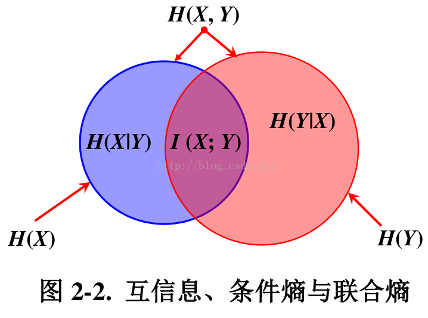

# Task 01 Notes
## 01 TF-IDF原理  

此部分学习了吴军<数学之美>中[数学之美 系列九 -- 如何确定网页和查询的相关性](https://china.googleblog.com/2006/06/blog-post_3066.html)

**单文本词频(Term Frequency)**:  用于衡量一个词在一个文件中的出现频率
$$
TF_w=关键词w的次数/网页的总字数
$$
需要给汉语中的每一个词给一个权重，这个权重的设定必须满足下面两个条件：

- 1. 一个词预测主题能力越强，权重就越大，反之，权重就越小。我们在网页中看到“原子能”这个词，或多或少地能了解网页的主题。我们看到“应用”一次，对主题基本上还是一无所知。因此，“原子能“的权重就应该比应用大。

- 2. 应删除词的权重应该是零。

在信息检索中，使用最多的权重是**“逆文本频率指数” （Inverse document frequency 缩写为 IDF）**：用于衡量一个词的重要性

$$
IDF_w=log D/D_w
$$
​		其中D为全部网页数，D(w)为出现关键词w的网页个数


为了避免D(w)为0的情况，IDF通常需要平滑化，常用的IDF平滑后的公式之一为：
$$
IDF_w=log (N+1)/(N_w+1)+1
$$
**equency/Inverse document frequency):**
$$
TF-TDF = TF_1*IDF_1 + TF_2*IDF_2 +...+ TF_n*IDF_n
$$


## 02 文本矩阵化，使用词袋模型，以TF-IDF特征值为权重

见TF_IDF_example.py

## 03 互信息的原理

**信息熵(Entropy):**


信息熵是对不确定性的衡量。变量的不确定性越大，熵也越大，信息量也就越大。

X定义在Y条件下的**条件熵**：


假设有两个随机事件，它们的**互信息(Mutual Information)**定义为：


其衡量的是两个随机变量之间的相关性，即一个随机变量中包含的关于另一个随机变量的信息量。

互信息 和 H(X), H(X/Y) 的关系：
$$
I(X;Y)=H(X)-H(X/Y)
$$


互信息、条件熵与联合熵的区别与联系：




## 04 互信息的应用

```python
from sklearn import metrics as mr

# 互信息(Mutual Information)
labels_true = [0, 0, 0, 1, 1, 1]
labels_pred = [0, 0, 1, 1, 2, 2]
MI = mr.adjusted_mutual_info_score(labels_true, labels_pred)  
print("Matual Information = "+str(MI))
# Matual Information = 0.2250422831983088
```


## 04 Datawhale Task3 特征选择 (2 days)

1. TF-IDF原理。
2. 文本矩阵化，使用词袋模型，以TF-IDF特征值为权重。（可以使用Python中TfidfTransformer库）
3. 互信息的原理。
4. 使用第二步生成的特征矩阵，利用互信息进行特征筛选。

参考
[文本挖掘预处理之TF-IDF：文本挖掘预处理之TF-IDF - 刘建平Pinard - 博客园](https://www.cnblogs.com/pinard/p/6693230.html
[使用不同的方法计算TF-IDF值：使用不同的方法计算TF-IDF值 - 简书](https://www.jianshu.com/p/f3b92124cd2b
[sklearn-点互信息和互信息：sklearn：点互信息和互信息 - 专注计算机体系结构 - CSDN博客](https://blog.csdn.net/u013710265/article/details/72848755
[如何进行特征选择（理论篇）机器学习你会遇到的“坑”：如何进行特征选择（理论篇）机器学习你会遇到的“坑” ](https://baijiahao.baidu.com/s?id=1604074325918456186&wfr=spider&for=pc