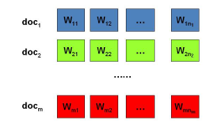

# LDA模型

## 01 LDA主题模型

有M篇文档，对应第d个文档中有$N_d$个词。即输入为如下图：

我们的目标是找到每一篇文档的主题分布和每一个主题中词的分布。在LDA模型中，我们需要先假定一个主题数目K，这样所有的分布就都基于K个主题展开。那么具体LDA模型是怎么样的呢？具体如下图：

---
**参考**：
1. 《统计学习方法》
2.  [文本主题模型之LDA(一) LDA基础](https://www.cnblogs.com/pinard/p/6831308.html)

