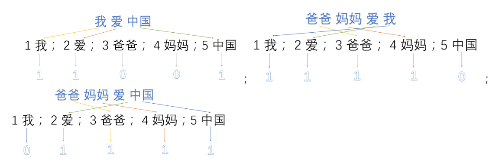

# 【**任务5-自然语言处理**】

## 01 统计语言模型

### 1.1 Language Model

Define V to be the set of all **words** in the language.

A **sentence** in the language is a sequence of words

$$
x_1x_2 . . . x_n
$$
where the integer n is such that n ≥ 1, we have $x_i$ ∈ V for i ∈ {1 . . . (n − 1)}, and $x_n$is a special symbol"STOP".

**Language Model**: $p(x_1...x_n)$ is a probability distribution over the sentences

### 1.2 MarKov Models

Language model after MarKov processing:

- (1) unigram language model 一元语言模型
  $$
  p(x_1...x_n)=\prod_{i=1}^nq(x_i)
  $$
  
- (2) bigram language model 二元语言模型
  $$
  p(x_1...x_n)=\prod_{i=1}^nq(x_i|x_{i-1})
  $$

- (3) trigram language model 三元语言模型
  $$
  p(x_1...x_n)=\prod_{i=1}^nq(x_i|x_{i-2},x_{i-1})
  $$

##  02 one-hot编码

### 2.1 one-hot编码

其方法是使用N位状态寄存器来对N个状态进行编码，每个状态都有它独立的寄存器位，并且在任意时候，其中**只有一位有效**。

### 

### 2.2 one-hot在提取文本特征上的应用

one hot在特征提取上属于词袋模型（bag of words）。关于如何使用one-hot抽取文本特征向量我们通过以下例子来说明。假设我们的语料库中有三段话：

　　　　我爱中国

　　　　爸爸妈妈爱我

　　　　爸爸妈妈爱中国

我们首先对预料库分离并获取其中所有的词，然后对每个此进行编号：

　　　　1 我； 2 爱； 3 爸爸； 4 妈妈；5 中国

然后使用one hot对每段话提取特征向量：

因此我们得到了最终的特征向量为

　　　　我爱中国 　->　　　1，1，0，0，1

　　　　爸爸妈妈爱我　　->　　1，1，1，1，0

　　　　爸爸妈妈爱中国　　->　　0，1，1，1，1

### 2.3 one-hot编码优缺点

**缺点：**没有考虑词与词之间的顺序；其次，它假设词与词相互独立（在大多数情况下，词与词是相互影响的）；最后，它得到的特征是离散稀疏的。

### 2.4 sklearn实现one-hot

* [one_hot_encoder.py](./one_hot_encoder.py)

## 03 word2vec

待整理

##  04 DataWhale 任务5要求 

Task5 文本表示：从one-hot到word2vec (2 days)

  - 词袋模型：离散、高维、稀疏。
  - 分布式表示：连续、低维、稠密。word2vec词向量原理并实践，用来表示文本。
  - [word2vec1](https://blog.csdn.net/itplus/article/details/37969519) [word2vec](http://www.hankcs.com/nlp/word2vec.html) 
  - word2vec 中的数学原理详解（一）目录和前言 - peghoty - CSDN博客  <https://blog.csdn.net/itplus/article/details/37969519>
  - word2vec原理推导与代码分析-码农场  <http://www.hankcs.com/nlp/word2vec.html>

---
**参考**：
1. 吴军著《数学之美》

2. **Michael Collins Notes**：[Michael Collins Notes](<http://www.cs.columbia.edu/~mcollins/lm-spring2013.pdf>)

3. **peghoty博客**： [word2vec 中的数学原理详解（三）背景知识](<https://blog.csdn.net/itplus/article/details/37969817>)

4. [特征提取方法: one-hot 和TF-IDF](https://www.cnblogs.com/lianyingteng/p/7755545.html)