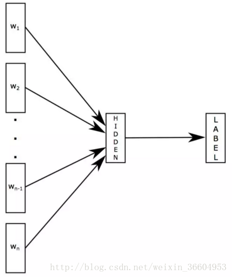
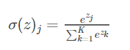
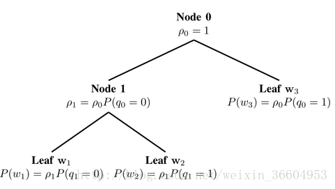

# 【**任务6-自然语言处理**】

## 01 FastText的原理

FastText算法是一种有监督的模型, 通过上下文预测标签 (这个标签就是文本的类别，是训练模型之前通过人工标注等方法事先确定下来的). 

FastText模型的输入是一个词的序列（一段文本或者一句话)，输出是这个词序列属于不同类别的概率。在序列中的词和词组构成特征向量，特征向量通过线性变换映射到中间层，再由中间层映射到标签。fastText在预测标签时使用了非线性激活函数，但在中间层不使用非线性激活函数。

第一个权重矩阵w_1可以被视作某个句子的**词查找表**。词表征被平均成一个文本表征，然后其会被馈送入一个线性分类器。该模型将一系列单词作为输入并产生一个预定义类的概率分布。我们使用一个softmax方程来计算这些概率。

当数据量巨大时，线性分类器的计算十分昂贵，所以FastText使用了一个基于霍夫曼编码树的分层softmax方法。

**softmax函数**

softmax函数实际是一个归一化的指数函数： 

而softmax把一个k维的real value向量（a1,a2,a3,a4….）映射成一个（b1,b2,b3,b4….）其中bi是一个0-1的常数，然后可以根据bi的大小来进行多分类的任务，如取权重最大的一维。

**分层softmax（Hierarchical softmax）**

分层softmax的目的是降低softmax层的计算复杂度。 Hierarchical softmax本质上是用层级关系替代了扁平化的softmax层，如图1所示，每个叶子节点表示一个词语（即霍夫曼树的结构）。 

把原来的softmax看做深度为1的树，词表V中的每一个词语表示一个叶子节点。如果把softmax改为二叉树结构，每个word表示叶子节点，那么只需要沿着通向该词语的叶子节点的路径搜索，而不需要考虑其它的节点。 利用FastText模型进行文本分类.

## 02 利用FastText模型进行文本分类

##  03 DataWhale 任务6要求 

**Task6 神经网络基础 (2 days )**

 建议第一天基础，第二天FastText

- 前馈神经网络、网络层数、输入层、隐藏层、输出层、隐藏单元、9激活函数的概念。
- 感知机相关；定义简单的几层网络（激活函数sigmoid），递归使用链式法则来实现反向传播。
- 激活函数的种类以及各自的提出背景、优缺点。（和线性模型对比，线性模型的局限性，去线性化）
- 深度学习中的正则化（参数范数惩罚：L1正则化、L2正则化；数据集增强；噪声添加；early stop；Dropout层）、正则化的介绍。
- 深度模型中的优化：参数初始化策略；自适应学习率算法（梯度下降、AdaGrad、RMSProp、Adam；优化算法的选择）；batch norm层（提出背景、解决什么问题、层在训练和测试阶段的计算公式）；layer norm层。
- FastText的原理。
- 利用FastText模型进行文本分类。
- [fasttext1](https://github.com/facebookresearch/fastText#building-fasttext-for-python) [fasttext2](https://github.com/salestock/fastText.py) [fasttext3 其中的参考](https://jepsonwong.github.io/2018/05/02/fastText/)

 

---
**参考**：
1. 吴军著《数学之美》

2. [文本分类需要CNN？No！fastText完美解决你的需求（后篇）](<https://blog.csdn.net/weixin_36604953/article/details/78324834>)

4. [文本分类需要CNN？ No！fastText完美解决你的需求（前篇）](<https://blog.csdn.net/weixin_36604953/article/details/78195462>)

5. [用gensim学习word2vec](https://www.cnblogs.com/pinard/p/7278324.html)