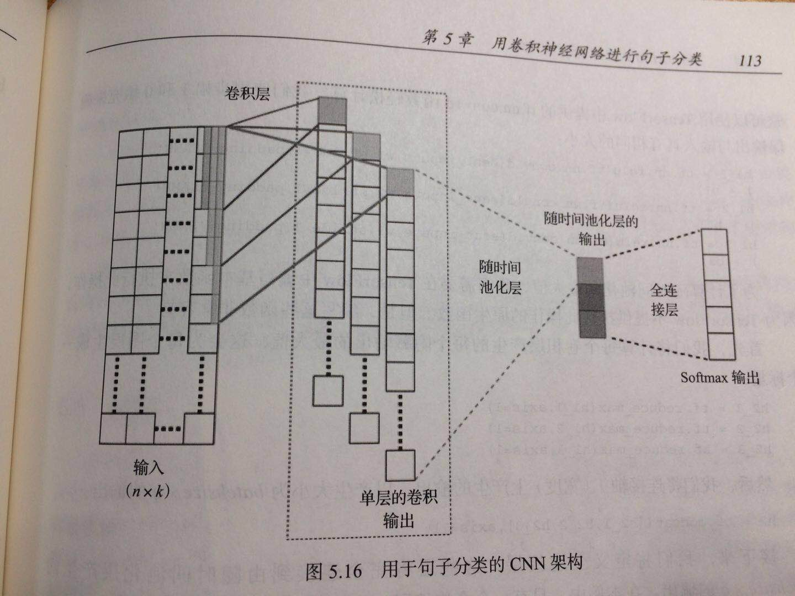

# 【**任务7-自然语言处理**】

## 01 用CNN进行句子分类

原理待整理.

**用于句子分类的CNN架构:**

##  

##  02 DataWhale 任务7要求 

**Task6 神经网络基础 (2 days )**

- ## Task7 卷积神经网络 (2 day)

  - 卷积运算的定义、动机（稀疏权重、参数共享、等变表示）。一维卷积运算和二维卷积运算。
  - 池化运算的定义、种类（最大池化、平均池化等）、动机。
  - Text-CNN的原理。
  -  利用Text-CNN模型来进行文本分类。

  - https://jepsonwong.github.io/2018/05/02/fastText/)

 

---
**参考**：
1. Thushan Ganegedara《Tensorflow自然语言处理》

2. 论文：Convolutional Neural Networks for Sentence Classification

4. 

5. [用gensim学习word2vec](https://www.cnblogs.com/pinard/p/7278324.html)