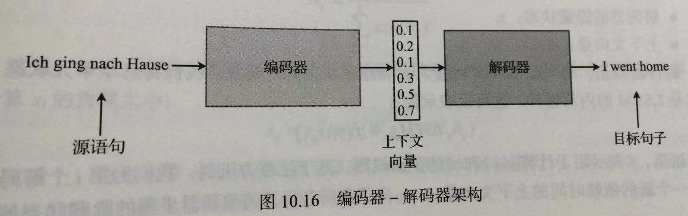
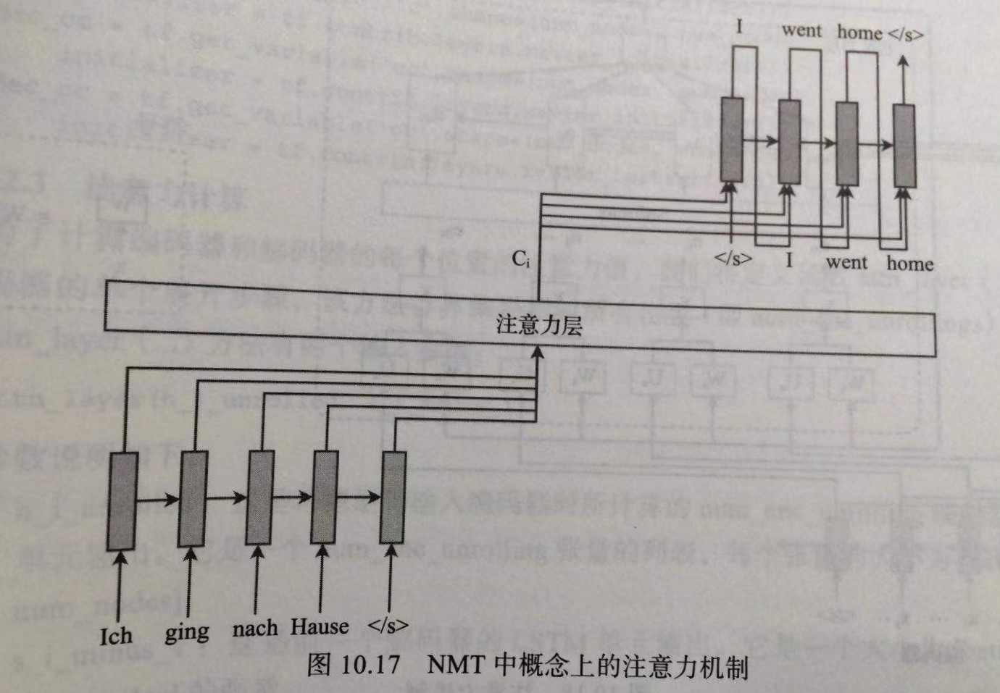
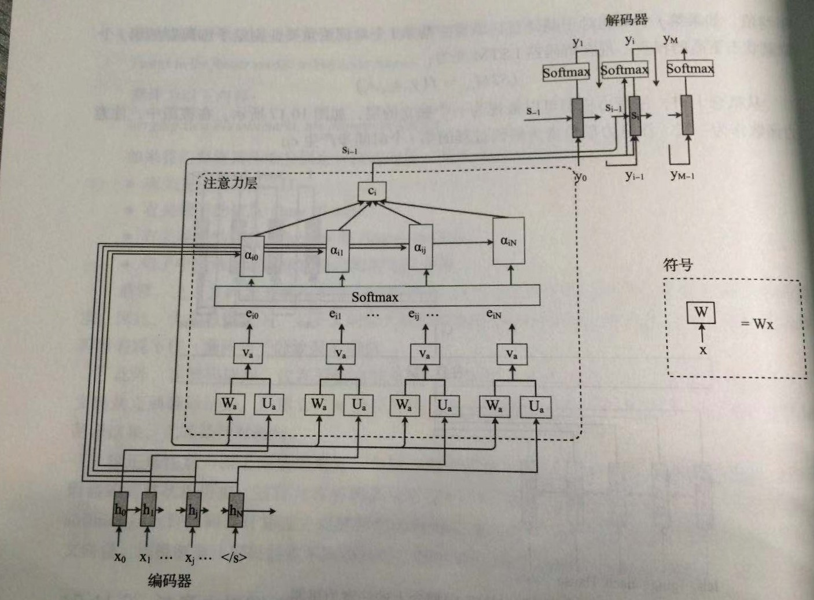

# 【**任务9-自然语言处理**】

## 01 注意力

### 1.1 突破上下文向量瓶颈

编码器-解码器架构：

通常，上下文向量元素大小为128或256。解码期间，解码器LSTM必须记住上下文向量直到翻译结束。对于长句，LSTM作用有限。

此时，利用注意力机制，解码器将在每个解码时间步访问编码器的完整状态历史，这将允许解码器获取源句的丰富的特征。此外，注意力机制的softmax层允许解码器计算过去观测到的解码器状态的加权平均值，这将用作解码器的上下文向量。

### 1.2 注意力机制细节

将使用的参数：

- 编码器的隐藏状态：$h_i$
- 目标句子的单词：$y_i$
- 解码器的隐藏状态：$s_i$
- 上下文向量：$c_i$

LSTM解码器由输入$y_i$和隐藏状态$s_{i-1}$组成：

$$
LSTM_{dec}=f(y_i,s_{i-1})
$$
其中$f$表示用于计算$y_{i+1}$和$s_1$的更新规则。

基于注意力机制，为第 $i$ 个解码器引入一个新的依赖时间的上下文向量 $c_i$ 。$c_i$向量是所有展开的解码器步骤的隐藏状态的加权平均值。如果第 $j$ 个单词对于翻译目标语言中的第 $i$ 个单词更重要，则给与编码器的第$j$ 个隐藏状态更高的权重。现在LSTM解码器为：
$$
LSTM_{dec}=f(y_i,s_{i-1}, c_i)
$$
从概念上讲，注意力机制可以视为一个独立的层，如下图所示：

注意力层负责为解码过程的第 $i$ 个时间步产生 $c_i$ :
$$
c_i= \sum_{j=1}^L \alpha_{ij}h_j
$$
其中， $L$ 是源句子的单词数， $\alpha_{ij}$ 是归一化权重，用于表示第 $j$ 个编码器隐藏状态对于计算第 $i$ 个编码器预测的重要度。这要使用softmax层进行计算：
$$
\alpha_{ij} = \frac{exp(e_{ij})}{\sum_{k=1}^Lexp(e_{ik})}
$$
其中，$e_{ij}$ 表示能量或重要度，用于度量编码器的第 $j$ 个隐藏状态和先前编码器状态 $s_{i-1}$ 对于计算 $s_i$ 的贡献大小：
$$
e_{ij}=v_{\alpha}^Ttanh(W_{\alpha}s_{i-1}+U_{\alpha}h_j)
$$
实质上， $e_{ij}$ 通过多层感知器来计算，而感知器权重为 $v_{\alpha}$、$W_{\alpha}$ 和 $U_{\alpha}$ ，而 $s_{i-1}$ 和 $h_j$ 是网络的输入。

**注意力机制**如下图所示：

## 02 实现注意力机制

见neural_machine_translation_attention.ipynb，为《Tensorflow自然语言处理》中将德语翻译成英语的范例。

##  03 DataWhale 任务9要求 

- ## Task 9 Attention原理 (2 days)

  - 基本的Attention原理。
  - HAN的原理（Hierarchical Attention Networks）。
  - 利用Attention模型进行文本分类

 

---
**参考**：
1. Thushan Ganegedara《Tensorflow自然语言处理》

2. [邱锡鹏-神经网络与深度学习](<https://nndl.github.io/>)

4. ### [Neural Machine Translation by Jointly Learning to Align and Translate](http://www.arxiv.org/abs/1409.0473)

