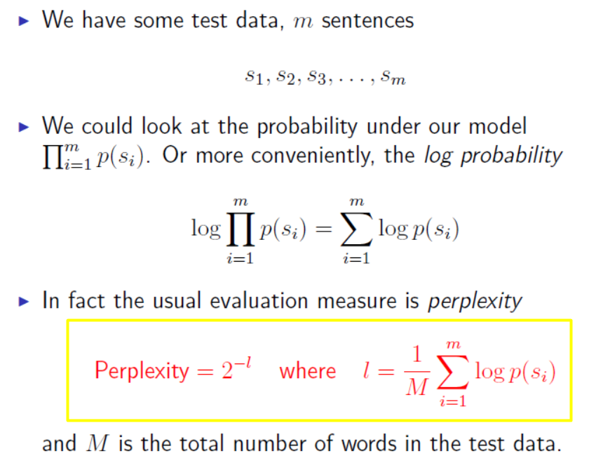

# Language Modeling

## 01 The language modeling problem

Some definition:

- **V** to be the set of all **words** in the language.
- A **sentence** in the language is a sequence of words

$$
x_1x_2 . . . x_n
$$
​	where the integer(整数) n is such that n ≥ 1, we have $x_i$ ∈ V for i ∈ {1 . . . (n − 1)}, and $x_n$is a special symbol"STOP".

- $V^+$: the set of all sentences with the vocabulary **V**

- **Language Model**: A language model consists of a finite set **V** and a function $p(x_1...x_n)$

  (1) $p(x_1...x_n)$ is a probability distribution over the sentences

  (2) For any $<x_1...x_n>\in V^+$, $p(x_1...x_n) \ge 0$ and $\sum p(x_1...x_n) = 1$

### 1.2 MarKov Models

Consider a sequence of random variables $X_1, X_2,..., X_n$, each random variable can take any value in a finite set **V**

**Our goal: model** 
$$
P(X_1=x_1, X_2=x_x,..., X_n=x_n)
$$

By the train rule ($P(A,B,C)=P(A)*P(B|A)*P(C|A,B)$), we have:
$$
\begin{equation}\begin{split}
& P(X_1=x_1, X_2=x_x,..., X_n=x_n) \\ 
= &P(X_1=x1)\prod_{i=2}^{n}P(X_i=x_i|X_1=x_1,...X_{i-1}=x_{i-1})
\end{split}\end{equation}
$$

**First-order Markov process :**
$$
\begin{equation}\begin{split}
& P(X_1=x_1, X_2=x_x,..., X_n=x_n) \\ 
= &P(X_1=x1)\prod_{i=2}^{n}P(X_i=x_i|X_1=x_1,...X_{i-1}=x_{i-1}) \\
= &P(X_1=x1)\prod_{i=2}^{n}P(X_i=x_i|X_{i-1}=x_{i-1})
\end{split}\end{equation}
$$
**Second-order Markov process :**
$$
\begin{equation}\begin{split}
& P(X_1=x_1, X_2=x_x,..., X_n=x_n) \\ 
= &P(X_1=x1)\prod_{i=2}^{n}P(X_i=x_i|X_1=x_1,...X_{i-1}=x_{i-1}) \\
= &P(X_1=x1)\prod_{i=2}^{n}P(X_i=x_i|X_{i-2}=x_{i-2}, X_{i-1}=x_{i-1})
\end{split}\end{equation}
$$

​	(For convenience we assume $x_0 = x_{-1} = *$, where * is a special "start" symbol.)

### 1.3 Language model after MarKov processing

- (1) unigram language model 一元语言模型
  $$
  p(x_1...x_n)=\prod_{i=1}^nq(x_i)
  $$
  
- (2) bigram language model 二元语言模型
  $$
  p(x_1...x_n)=\prod_{i=1}^nq(x_i|x_{i-1})
  $$

- (3) trigram language model 三元语言模型
  $$
  p(x_1...x_n)=\prod_{i=1}^nq(x_i|x_{i-2},x_{i-1})
  $$

## 02 Evaluating language models: perplexity (迷惑度)

### 2.1 Perplexity (迷惑度)

**The smaller** the value of perplexity, **the better** the language model is at modeling unseen data.

### 2.2 Typical Values of Perplexity

Results from Goodman (A bit of progress in language modeling"), where |V|= 50000

- A trigram model: Perplexity = 74
- A bigram model: Perplexity = 137
- A unigram model: Perplexity = 955

So the trigram model clearly gives a big improvement over bigram and unigram models.

## 03 Estimation techniques 平滑估算

### 3.1 Linear interpolation 线性插值

### 3.2 Discounting methods 折扣方法

---
**参考**：
1. 吴军著《数学之美》

2. **Michael Collins Notes**：[Michael Collins Notes](<http://www.cs.columbia.edu/~mcollins/lm-spring2013.pdf>)

