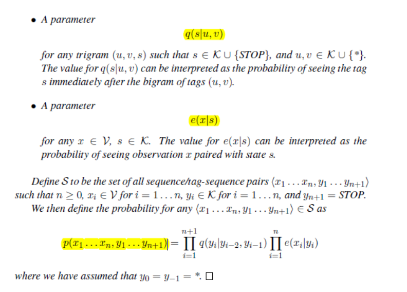

# Tagging Problems and Hidden Markov Models

[TOC]

## 01 Introduction

**Tagging problem (sequence labeling problem)** : 

​								map a sentence $x_1 ... x_n$ to a tag sequence $y_1 ... y_n$

Assume we have a set of training examples:
$$
(x^{(i)},y^{(i)})  for i=1...m 
$$

- each $x^{(i)}$ is a sentence $x_1^{(1)}x_2^{(2)}...x_n^{(i)}$
- each $y^{(i)}$ is a tag sequence $y_1^{(1)}y_2^{(2)}...y_n^{(i)}$

## 02 The Tagging Problem

### 2.1 Part-of-speech Tagging (POS Tagging) 词性标注

词性标注的范例：

Challenges in POS tagging:

- ambiguity, 即每个单词可能有多种词性
- rare words, 即为在训练库中的单词

Two Types of Constraints (两种约束解决POS tagging问题)：

- individual words have **statistical preferences** for their part of speech
- **the context** has an important effect on the part of speech for a word

### 2.2 Named-Entity Recognition 命名实体识别

命名实体识别的标注实例：

Each word in the sentence is tagged as an entity. 

## 03 Generative Models, and The Noisy Channel Model 生成式模型和噪声信道模型

### 3.1 Supervised Learning Problems

We assume training examples $(x^{(1)},y^{(1)}) ... (x^{(m)},  x^{(m)})$, where each example consists of an **input** $x^{(i)}$
paired with a **label** $y^{(i)}$. 

(We use **X** = the set of possible inputs, and **Y** = the set of possible labels.)

Task is to learn a **function $f_{(x)}$** mapping inputs x to labels f(x):  
$$
x\to f_{(x)}
$$
Ways  to define the function $f_{(x)}$ :

- conditional model (discrimination model) 判别模型
- generative model 生成模型

### 3.2 conditional model (discrimination model) 判别式模型

Define a model with **conditional probability 条件概率** for  any x,y model :
$$
p(y|x)
$$
Given a **new test example x**, the output from the model is :
$$
f_{(x)}=\mathop {argmax}_{y \in Y}p(y|x)
$$
判别模型是直接训练得到条件概率 $p(x|y)$ 来构建模型

### 3.3 generative model 生成式模型

- **Generative models:**

  - Learn a distribution $p(x, y)$ from training examples (从训练样本中构建一个联合概率分布 $p(x, y)$)

  - 对联合概率分布 $p(x, y)$ 有
    $$
    p(x,y)=p(y)p(x|y)
    $$

- Note(贝叶斯公式): 
  $$
  p(y|x)=\frac {p(y)p(x|y)}{p(x)}
  $$
  where
  $$
  p(x)=\sum_{y \in Y}p(x,y)=\sum_{y \in Y}p(y)p(x|y)
  $$

- **Given an input $x$ ,the output of the model $f(x)$ :**
  $$
  \begin{equation}\begin{split}
  f(x) &= arg\,\max_y p(y|x) \\
       &= arg\,\max_y \frac{p(y)p(x|y)}{p(x)}   \ \ \ \ \ \ \ \ \ \  (1)  \\
       &= arg\,\max_y p(y)p(x|y)                \ \ \ \ \ \ \ \ \ \ \ (2)
  \end{split}\end{equation}
  $$
  Eq.(2) follows because the denominator $p(x)$ , does not depend on $y$, and hence does not affect the $arg max$.

- **Noisy Channel Model 噪声信道模型 :**

  Models that decompose a joint probability into terms p(y) and p(x|y) are often called noisy-channel models.

## 04 Trigram Hidden Markov Models (Trigram HMMs) 三元隐性马尔科夫模型

### 4.1 Definition of Trigram HMMs 定义

- Definition  **(Trigram Hidden Markov Model (Trigram HMM))** A trigram HMM consists of a finite set $V$ of possible **words**, and a finite set $K$ of possible **tags**, together with the following parameters:

- 为什么叫隐性马尔科夫模型？

  因为Trigram HMM模型中隐含着"Markov Chain"(如图展开Trigram HMM模型所示)

- An example:

  - Input: $x_1 x_2 x_3$ equal to the sentence "the dog laughs"

  - Output: $y_1 y_2 y_3 y_4$ equal to the tag sequence "D N V STOP"

  -  then 
  $$
  \begin{equation}\begin{split}
    & p(x_1..x_n,y_1...y_{n+1}) \\
    = & q(D|*,*) \cdot q(N|*,D) \cdot  q(V|D,N) \cdot q(STOP|N,V) \\
      & \cdot e(the|D) \cdot e(dog|N) \cdot e(laughs|V)
    \end{split}\end{equation}
  $$

### 4.2 Independence Assumptions  

- Model the joint probability
  $$
  P(X_1=x_1...X_n=x_n,\ Y_1=y_1...Y_n=y_n)
  $$
  for any observation sequence $x_1 ... x_n$ paired with a state sequence $y_1 ... y_n$, where
  each xi is a member of V, and each yi is a member of K.

  
  
- Add $Y_{n+1} = STOP$ , **the key idea of HMM:**
  $$
  \begin{equation}\begin{split}
  & P(X_1=x_1...X_n=x_n,\ Y_1=y_1...Y_{n+1}=y_{n+1})     \\ 
  = & P(Y_1=y_1...Y_{n+1}=y_{n+1}) P(X_1=x_1...X_n=x_n|Y_1=y_1...Y_{n+1}=y_{n+1}) \ \ \ \ (1)   \\
  = &\prod_{i=1}^{n+1}P(Y_i=y_i|Y_{i-2}=y_{i-2}, Y_{i-1}=y_{i-1})\prod_{i=1}^{n}P(X_i=x_i|Y_{i}=y_{i})      \ \ \ \ \ \ \ \ \ \ \ \ \ \ \ \ \ \ \ \ \ (2) 
  \end{split}\end{equation}
  $$

  - (1) 过程由**链式法则**得出
  - (2) 过程由**二元马尔科夫假设**和**观测独立性假设**得出

- **二元马尔科夫假设**： 即假设隐藏得马尔科夫链在任意i时刻的标注状态 (tag) 只依赖于前两个时刻的标注状态
  $$
  \begin{equation}\begin{split}
  & P(Y_1=y_1...Y_{n+1}=y_{n+1})   \\
  = &\prod_{i=1}^{n+1}P(Y_i=y_i|Y_{i-2}=y_{i-2}, Y_{i-1}=y_{i-1})
  \end{split}\end{equation}
  $$
  
- **观测独立性假设**： 即假设任意时刻的观测(word) 只依赖于该时刻的马尔科夫链的标注状态
  $$
  \begin{equation}\begin{split}
  P  &(X_1=x_1...X_n=x_n|Y_1=y_1...Y_{n+1}=y_{n+1})    \\
   = &\prod_{i=1}^{n}P(X_i=x_i|Y_{i}=y_{i})       
  \end{split}\end{equation}
  $$
  

### 4.3 Estimating the Parameters 参数估计

暂缺

### 4.4 The Viterbi Algorithm

暂缺

---
**参考**：
1. 吴军著《数学之美》
2. **Michael Collins Notes**：[Michael Collins Notes](<<http://www.cs.columbia.edu/~mcollins/hmms-spring2013.pdf>>)

