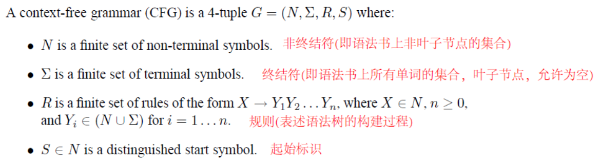

# Probabilistic Context-Free Grammars (PCFGs)

[TOC]

## 01 Context-Free Grammars 上下文无关语法

### 1.1 Basic Definition

- **Basic Definition**: 

- An example

Notes： preposition 介词        determiner 限定词

### 1.2 Left-Most Derivations 最左推导

- Left-Most Derivations 最左推导：

- An Example

- **Properties of CFGs**
  - A CFG denes a set of possible derivations
  - A string $ s \in \sum^*$ is in the language dened by the CFG if there is at least one derivation that yields $s$
  - Each string in the language generated by the CFG may have more than one derivation (**ambiguity**)

## 02 English Syntax 英语句法规则

### 2.1 Part of speech  词性 (tags from the Brown corpus)

- **Nouns** 
  - NN = singular noun    							e.g. man, dog
  - NNS = plural noun 复数名词 				e.g. telescopes, houses
  - NNP = proper noun 固有名词			    e.g. Smith, IBM

- **Determiners 限定词**
  - DT = determiner                                    e.g., the, a, some, every

- **Adjectives 形容词**
  - JJ = adjective                                        e.g., red, green, large, idealistic

### 2.2 Noun Phrase 名词短语

$$
\overline N \to NN                                 \\
\overline N \to NN \ \  \overline N				   \\
\overline N \to JJ \ \  \overline N				   \\
\overline N \to \overline N \ \  \overline N	   \\
NP \to DT \ \  \overline N
$$

**e.g.**	the car		the fast car 		the fast red car 		the car factory

### 2.3  Prepositions, and Prepositional Phrases 介词和介词短语

- **Prepositions 介词**
  
- IN = Prepositions                              e.g., of, in, out, besides, as
  
- **Prepositional Phrases 介词短语**

  - PP = Prepositional Phrase               e.g., in the room

    $ PP \to IN \ \ \ NP$

### 2.4 Verbs, Verb Phrases 动词和动词短语

- **Verbs 动词**

  - Vi = Intransitive verb                                                         e.g., sleeps, walks, laughs
  - Vt = Transitive verb                                                          e.g., sees, saw, likes
  - Vd = Ditransitive verb (双及物动词，后接双宾语)           e.g., gave

- **Verb Phrases 动词短语 (VP)**
  $$
  \begin{equation}\begin{split}
  & VP \  \to \ \ Vi             \\
  & VP \  \to \ \ Vt \ \ NP             \\
  & VP \  \to \ \ Vd \ \ NP \ \  NP             \\
  &  VP \  \to \ \ VP \ \ PP (介词短语)             \\
  \end{split}\end{equation}
  $$
  Examples of VP :           sees the dog,     sleeps in the car

### 2.5 Sentences 

- **sentence 句子(S)**

  $ S \  \to  \ \  NP \ \  VP $

  Examples of S :          the man sleeps,  the dog walks

### 2.6 Complementizers, and SBARs 补语

- Complementizers      引导补语从句的补语化成分(COMP)

  COMP = Complementizer           e.g.   that

- SBAR 
  $$
  SBAR \ \to \ \  COMP \ \  S
  $$

- Examples:    that the man sleeps,

### 2.7 Coordination 连词

- Coordination

  CC = Coordinator                  e.g., and, or, but

- New **Rules**
  $$
  \begin{equation}\begin{split}
  & NP \to NP \ \  CC  \ \  NP                                \\
  & \overline N \to \overline N \ \  CC \ \  \overline N				   \\
  & VP \to VP \ \  CC  \ \  VP 				   \\
  & S \to S \ \  CC  \ \  S 	       \\
  & SBAR \to SBAR \ \  CC  \ \  SBAR 
  \end{split}\end{equation}
  $$
  

## 03 Ambiguity 

上下文无关的语法可以很容易的推导出一个句子的语法结构，但是缺点是推导出的结构可能存在二义性。

常见的二义性问题有：

- 1）单词的不同词性，如can一般表示“可以”这个情态动词，有时表示罐子；

-  2）介词短语的作用范围，如VP PP PP这样的结构，第二个介词短语可能形容VP，也可能形容第一个PP；

- 3）连续的名字，如NN NN NN

## 04 Probabilistic Context-Free Grammars (PCFGs) 概率分布的上下文无关语法

### 4.1 Basic Definations

The key idea in **probabilistic context-free grammars  (PCFGs)** is to extend our definition to <u>give a probability distribution over possible derivations.</u>  即对一个句子的每一条可能的分析树t 赋予一个概率 p(t)
$$
p(t) \ge 0    \\
\sum_{t \in {\tau_G}}p(t)=1
$$
Where $ \tau_G$ is the set of all possible left-most derivations (parse trees) under the grammar G.

则p(t)定义了一个句子的所有可能分析树的概率(ranked over possible parses for any sentence in order of probability)

特别的，对一个句子s, 
$$
arg\,\max_{t \in \tau_G(s)}\ \  p(t)
$$
就是句子s的最有可能的分析树.

### 4.2 Definition PCFGs  

**A PCFG consist of :**

- (1) A context-free grammar $G = (N,\sum, S,R)$.  一个上下文无关语法句子

- (2) A parameter
  $$
  q(\alpha \to \beta)
  $$
  for each rule $\alpha \to \beta \in R $. The parameter $ q(\alpha \to \beta) $ can be interpreted as the conditional probabilty of choosing rule $\alpha \to \beta  $ in a left-most derivation, given that the non-terminal being expanded is α. For any $X \in N $, we have the constraint:
  $$
  \sum_{\alpha \to \beta \in R:\alpha=X}q(\alpha \to \beta)=1
  $$
  Given a parse-tree (分析树) $t \in \tau_{G}$ containing rules $ \alpha_1 \in \beta_1, \  \alpha_2 \in \beta_2, \ ... \alpha_n \in \beta_n \ $ ,the probability of $t$ under the PCFG is :
  $$
  p(t)=\prod_{i=1}^n q(\alpha_i \to \beta_i)
  $$
  

**An example**

For X=VP constraint:
$$
VP \to Vi  \ \ \ \ \ \ \  \ \ 0.3  \\
VP \to Vt \ NP \ \ 0.5              \\
VP \to VP \ PP \ \ 0.2 
$$

  

### 4.3 Deriving a PCFG from a Corpus

还是用语料库中的数据 ，用最大似然估计计算每一个规格Rule的概率
$$
q_{ML}(\alpha \to \beta) = \frac {Count(\alpha \to \beta)}{Count(\alpha)}
$$

### 4.4 Parsing with PCFGs

定义 $p(t)$ 同时通过语料库计算好所有参数的值后，需要做的是求$p(t)$最大值，即：
$$
arg\,\max_{t \in \tau_G(s)}\ \  p(t)  \ \ \ ?
$$
这就需要用到动态算法**CKY算法**，在使用CKY算法前，需要用到**CNF语法**.

- **(1) Chomsky Normal Form (CNF)**  Chomsky范式

CNF格式与PCFG不同之处在于：每条规则只能是 $X \to Y_1Y_2 \ $ 或 $X \to  Y$ (即每个非终结符只能推导出两个非终结符或者一个终结符). Chomsky语法格式保证生产的语法树总是**二叉树**的格式，同时任意一棵语法树总是能够转化成Chomsky语法格式。

- **Dynamic programming table**

The CKY algorithm is a dynamic-programming algorithm.

- **The CKY parsing algorithm**

---
## 参考
1. 吴军著《数学之美》
2. **Michael Collins Notes**：[Michael Collins Notes](<<http://www.cs.columbia.edu/~mcollins/hmms-spring2013.pdf>>)
3. 博客：[自然语言处理 - 语法解析](https://blog.csdn.net/lanxu_yy/article/details/37700841)
4.  博客：[统计自然语言处理(概率上下文无关文法)](<https://blog.csdn.net/continueoo/article/details/72851724>)
5. 博客：[NLP 学习笔记 03 (Probabilistic Context-Free Grammars (PCFGs))](<https://blog.csdn.net/dark_scope/article/details/8718338>)

