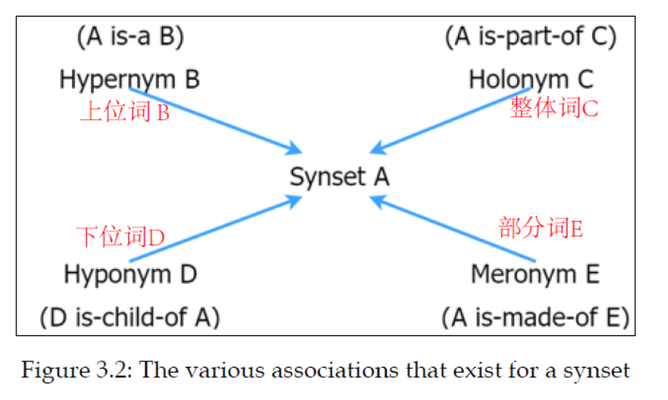

# Chapter03 Word2vec

## 3.1 单词的表示或含义是什么

Meaning is the idea or the representation conveyed by a word. 意义是一个单词所表达的想法或某种表示。

## 3.2 单词表示的经典方法

### 3.2.1 WordNet--使用外部词汇知识库来学习单词表示

WordNet依赖于**外部词汇知识库**，该知识库对给定单词的意义、同义词、词源、派生词等信息进行编码。

- 术语
  - **synset** : 表示一群或一组同义词
  - **definition** :每个synset 都有一个definition，用于解释synset表示的内容
  - **lemmas** :synset中包含的同义词

在WordNet中，单词的表示是分层建模的，它在给定的synset与另一个synset之间进行**关联**形成一个复杂的图。有两种不同的关联方式： is-a 关系 或 is-made-of 关系。

-  **is-a 关系**

  对于给定的synset，存在两类关系：上位词和下位词。

  - **上位词** ：是所考虑的gynset的一般含义(或更高一层) 的同义词。

    例： vehicle是同义词car的上位词

  - **下位词**： 是比相应的同义词组更具体的同义词。

    例： Toyota car 是同义词car的下位词

    

- **is-made-of 关系**

  - **整体词**：一个synset的整体词是可以表示所考虑的这个synset的**全部实体**的synset 。
  - **部分词**：是组成相应synset的一部分或子部分。

一个synset的不同关联：

使用NLTK库处理WordNet的实例见：[WordNet by NLTK](./wordnet.py)

- WordNet的问题
  - 缺少细微差别
  - WordNet本身就是主观的
  - 需要人工维护和添加新的synsets、definitions、lemmas等
  - 其他语言开发成本高

### 3.2.2 独热编码表示方式(one-hot编码)

如果我们有一个$V$大小的词汇表， 对于第$i$个词$w_i$表示为个长度为$V$的向量：
$$
w_i:\ [0,0,...,0,1,0,...,0,0]
$$
其中第$i$个元素为1，其他元素为0。

例如对于句子"Bob and Mary are good friends"，其每个单词的独热表示为：
$$
Bob:[1,0,0,0,0,0]  \\
and:[0,1,0,0,0,0]  \\
Mary:[0,0,1,0,0,0]  \\
are:[0,0,0,1,0,0]	\\
good:[0,0,0,0,1,0]	\\
friends:[0,0,0,0,0,1]	\\
$$

- 缺点

  (1) 没有用任何方式对单词之间的相似性编码

  (2) 完全忽略了单词的上下文

  (3) 它得到的特征是离散稀疏的

- 作用

  使用独热码将单词表示为数字向量，并将其送入神经网络，以便神经网络可以学习单词的更好和更短的数字特征表示。

### 3.2.3 TF-IDF方法

TF-IDF是一种基于频率的方法，是一种表示给定文档中特定单词的重要性的单词表示。单词的频率越高，该单词在文档中就越重要。

**单文本词频(Term Frequency)**:  用于衡量一个词在一个文件中的出现频率
$$
TF_w=关键词w的次数/文件的总字数
$$
需要给每一个词给一个**权重**，在信息检索中，使用最多的权重是**“逆文本频率指数” （Inverse document frequency 缩写为 IDF）**：用于衡量一个词的重要性

$$
IDF_w=log D/D_w
$$
​		其中D为全部文件数，D(w)为出现关键词w的文件个数

为了避免D(w)为0的情况，IDF通常需要平滑化，常用的IDF平滑后的公式之一为：
$$
IDF_w=log (N+1)/(N_w+1)+1
$$
**TF-IDF(equency/Inverse document frequency):**
$$
TF-IDF = TF_1*IDF_1 + TF_2*IDF_2 +...+ TF_n*IDF_n
$$

例子：(有两个文件如下)

- doc1: This is about cats. Cats are great companions.

- doc2: This is about dogs. Dog are very loyal.

  计算部分单词的TF-IDF:
  $$
  TF-IDF(cats,doc1)=(2/8)*log(2/1)=0.075  \\
  TF-IDF(this,doc2)=(1/8)*log(2/2)=0.0
  $$
  因此，“cats"这个词具有丰富的信息，而"this"没有。

有关TF-IDF，详细解释见[TF-IDF](TF_IDF.md)，例子见[TF_IDF_example](./TF_IDF_example.py)

### 3.2.4 共轭矩阵

共轭矩阵对单词的上下文信息进行编码，但是需要维持$V*V$矩阵。

这里详细解释后面看了再补，书里讲的很简略。

## 3.3 Word2vec--基于神经网络学习单词表示

具体见[Word2vec](./Word2vec.md)

-----

**参考**：

1. [数学之美 系列九 -- 如何确定网页和查询的相关性](https://china.googleblog.com/2006/06/blog-post_3066.html)
2. [特征提取方法: one-hot 和TF-IDF](https://www.cnblogs.com/lianyingteng/p/7755545.html)
3. peghoty博客**： [word2vec 中的数学原理详解（三）背景知识](<https://blog.csdn.net/itplus/article/details/37969817>)
4. [用gensim学习word2vec](https://www.cnblogs.com/pinard/p/7278324.html)
5. 