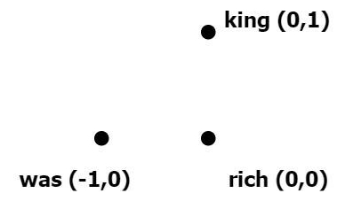
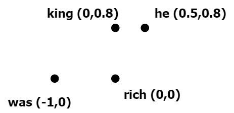
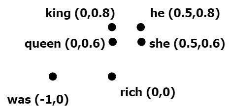
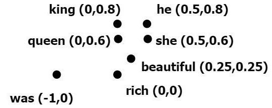

## Word2vec  基于神经网络学习单词表示

Word2vec利用给定单词的上下文来确定它的语义。**上下文**表示给定单词的前面和后面固定数量的单词。

假设有一个包含$N$个单词的语料库，可以用$w_0, w_1,..., w_i,..., w_N$表示一系列的单词表示，其中$w_i$是语料库中的第$i$个单词。

给定一个单词$w_i$，要正确预测上下文单词，下面的概率应该最高：
$$
P(w_{i-m},...,w_{i-1},w_i,w_{i+1},...,w_{i+m}|w_i)= \prod_{j \ne i \land j=i-m}^{i+m}P(w_j|w_i)
$$
注：上述等式成立需假设目标单词的上下文单词彼此独立。

## 01 练习：queen = king-he+she 吗

假定有一个小的语料库：

*There was a very rich king. He had a beautiful queen. She was very kind.*

预处理 (删除标点和无信息单词) 后：

*was rich king he had beautiful queen she was kind*

假设两边的上下文窗口大小都是1，我们用其上下文单词为每个单词形成一组元组，其格式为：

$$
目标单词 \to^{预测} 上下文单词1， 上下文单词2
$$

对于上诉语料库，形成的元组是：
$$
was \to rich  					    \\
\mathbf {rich \to was,king}         \\
\mathbf {king \to rich,he}          \\
he \to king,had  					\\
had \to he,beautiful				\\
beautiful \to had queen		        \\
\mathbf {queen \to beautiful,she}	\\
\mathbf {she \to queen,was}		    \\
was \to she,kind		            \\
kind \to was						\\
$$

我们的目标是**给出左侧的单词预测右侧的单词**，要做到这一点，对于给定的单词，右侧上下文中的单词应该与左侧在**数值或几何上具有很高的相似性**。

假定以实际的数值向量来解释如何实现（为了简单描述，仅考虑上述黑体元组）：

-----

- 设rich对应以下数值：

$$
  rich \to [0,0]
$$

- 为了能正确地从**rich 预测 was和king**,was和king应该与rich这个词有很高的相似性。使用向量之间的欧几里德距离(用Dist表示)为相似性结果。

  为单词king和rich尝试以下值：

$$
king \to [0,1]		\\
was \to [-1,0]		\\
$$

​	得到和rich的欧几里德距离(Dist)：	
$$
Dist(rich,king)=1.0		\\
Dist(rich,was)=1.0
$$
​	单词rich、was和king的词向量位置：

- 考虑元组$ king \to rich, he$ 

  我们认为两个词之间的关系越紧密，这两个词就越接近。

  上面已经建立了king和rich之间的关系，现在我们首先调整king的向量，使它更接近rich:
  $$
  king \to [0,0.8]
  $$
  接下来，我们需要添加单词he，单词he更接近king这个词，设置he表示为：
  $$
  he \to [0.5,0.8]
  $$
  此时，单词rich、was、king和he的词向量位置：

  

- 考虑元组$she \to queen,was$ (调换语料库元组顺序，方便理解)

  将she放在与单词he同was在距离上同样远的地方（语法知识：she和he 都是人称代词，与was的相似性应一样），设置she表示为：
  $$
  she \to [0.5,0.6]
  $$
  接下来，用queen接近单词she，设置queen的值为：
  $$
  queen \to [0.0,0.6]
  $$
  此时，单词rich、was、king、he和queen的词向量位置：

  

- 考虑元组$queen \to beautiful,she$

  单词beautiful应与queen和she有大致相同的距离，设置beautiful表示为：
  $$
  beautiful \to [0.25,0.25]
  $$
  此时，单词rich、was、king、he、queen和beautiful的词向量位置：

  

现在单词rich、was、king、he、queen和beautiful的词向量都确定好了，计算等式$queen=king-he+she?$
$$
queen=[0,0.6]		\\
king-he+she=[0,0.8]-[0.5,0.8]+[0.5,0.6]=[0,0.6] \\
即 queen=king-he+she
$$
这是一个简单的理解词向量的例子，但是，根据同样原理的过程，对于现实中巨大的语料库，通过复杂的函数逼近方法(如神经网络)，我们可以建立词汇的数学表达形式 (考虑上下文+相似性，而不是简单的one-hot编码)

## 02 定义损失函数

## 03 skip-gram算法

## 04 连续词袋模型(CBOW模型)

-----

**参考**

1. 《Tensorflow自然语言处理》第三章 Word2vec 学习词嵌入
2. 

    