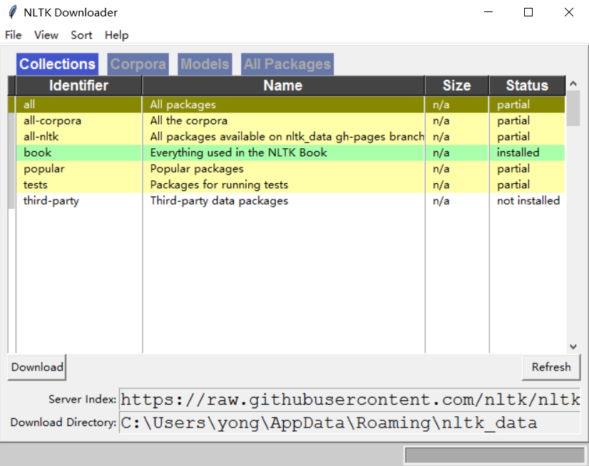
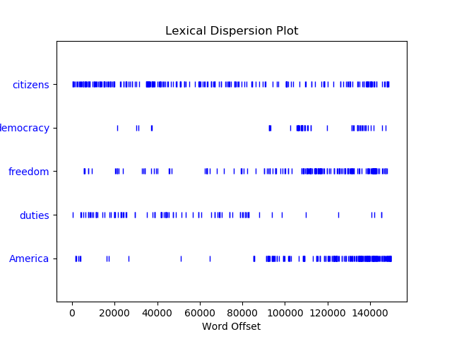

# Chapter-1_语言处理与Python

## 1.1 安装NLTK

直接用 'pip install nltk' 安装, 安装完成后import nltk, 然后使用nltk.download() 函数



具体程序见[01_Getting_Started_with_NLTK](./01_Getting_Started_with_NLTK)


## 1.2 搜索文本

**搜索单词： 文本.concordance("要搜索的单词")**
**查找相关的词： 文本.similar("要搜索的单词")**
**查找多个词相关的词： 文本.common_contexts(["要搜索的单词1"，"要搜索的单词2",...])**
**用离散图表示单词词在文本中的位置：文本.dispersion_plot(["单词1", "单词2", "单词3", ...])**

```python
print("\n查一下《白鲸记》(text1)中的单词'monstrous'：")
text1.concordance("monstrous")

print("\n查一下《白鲸记》(text1)中的词'monstrous'相关的词")
text1.similar("monstrous")

print("\n查一下《理智与情感》(text2)中的词'monstrous'和'very'相关的词")
text2.common_contexts(["monstrous", "very"])

# 绘制《美国总统就职演说》(text4)中词汇分布图
text4.dispersion_plot(["citizens", "democracy", "freedom", "duties", "America"])
```


